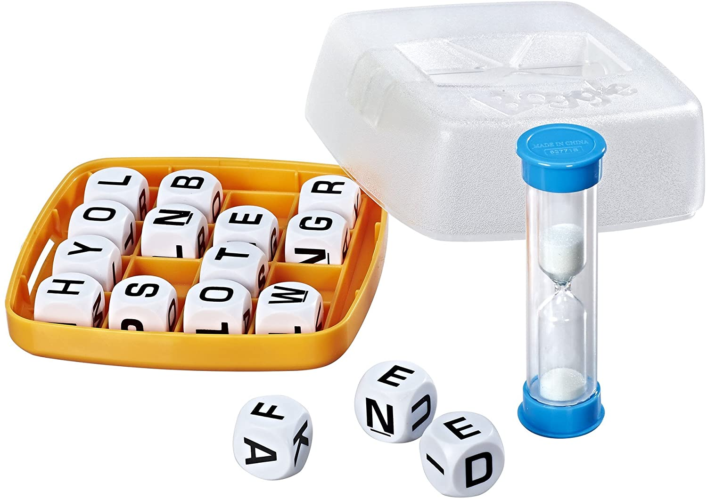

# AI Boggle Solver ✅
boggle solver powered by artificial intelligence! ⚡

Boggle is a game played on a 5 by 5 grid of letter where the purpose is to find as many connected words.

A connected words is a sequence of contiguous letter touching in all possible 8 direction forming a word where letters cannot repeat!

There is a time limit for how long you have to find the maximum amount of words (2min). Players get points for every unique word they get compared to the others. The longer the word the more point!

## Problem ❓
The problem we are trying to solve here is to find as many words as possible in a given board game within the time allocated.

It's that "simple"!

## Variant 🐻
There is a few variant of the original boggle game which includes:
- different size of square boards
- different time limit

## Current State 🦝
There is absolutely nothing working right now 👍👍👍

This program requires a dictionary files to understand how to find a word.
The current dictionary included is an english one:
- [English only Alphabetical Words](https://github.com/dwyl/english-words/blob/master/words_alpha.txt)

## License
This is MIT!